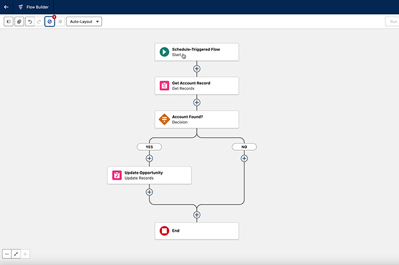

[](https://github.com/IvanRublev/hb2sffree/)

# hs2sffree

[](https://github.com/IvanRublev/hb2sffree/actions/workflows/branch.yml)

A data migration tool that downloads data from HubSpot and converts it into CSV files ready to import into Salesforce Free CRM.

## What It Does

- Downloads Companies, Contacts, and Deals from HubSpot
- Converts HubSpot data to Salesforce format keeping the associations between objects
- Generates two CSV files in the `output/` directory:
  - `accounts_contacts.csv` - HubSpot Companies → Salesforce Accounts; HubSpot Contacts → Salesforce Contacts
  - `opportunities.csv` - HubSpot Deals → Salesforce Opportunities
- Skips invalid records and logs them into the following CSV files:
  - `errors_accounts_contacts.csv`
  - `errors_opportunities.csv`

The tool can migrate up to 50,000 records per CSV file.

## Importing to Salesforce

**Accounts & Contacts:**
1. Open Accounts → Import → Data Import Wizard
2. Select "Accounts and Contacts" - "Add new records"
3. Match Contact by Name, Match Account by Name & Site
4. Choose CSV with Character Code option set to Unicode (UTF-8)
5. Upload `accounts_contacts.csv` by pressing the Browse button and follow the wizard

**Opportunities:**
1. Open Sales → Opportunities → Import
2. Select "Import From File"
3. Upload `opportunities.csv` and follow the wizard
4. When import has finished, perform the association step described below

The tool persists Account name in the Next Step field of the Opportunity. 
To complete the association create and run the Flow automation in Salesforce 
as shown in the following video:

<a href="https://github.com/IvanRublev/hb2sffree/raw/refs/heads/master/flow_to_set_opportunity_accounts.mp4">
  
</a>


## Prerequisites

### HubSpot Access Token

Create a legacy private app in your HubSpot account:
1. Go to Settings → Integrations → Private Apps
2. Create a new app with read scopes for: Companies, Contacts, Deals
3. Copy the access token 
4. Set the access token as `HUBSPOT_TOKEN` environment variable within `.env` file

## Running from the source code

1. **Clone the repository**
   ```bash
   git clone https://github.com/IvanRublev/hb2sffree
   cd hs2sffree
   ```
   
   Or download as a zip archive by pressing the Code -> Download ZIP.

2. **Install Python and uv**

    **macOS:**
    ```bash
    # Using asdf
    asdf install
    # Or using Homebrew
    brew install python@3.12
    brew install uv
    ```

    **Windows:**
    
    * Download Python 3.12+ from [python.org](https://www.python.org/downloads/) and run the installer
    * Download and install uv from [astral.sh/uv](https://astral.sh/uv)

3. **Install dependencies**
   
   ```bash
   uv sync
   ```

4. **Run the tool**
    ```bash
    python main.py
    ```

## License

Copyright © 2025 Ivan Rublev

This project is licensed under the **MIT License**.
